# Customer Support Order Tracking System - Visual Documentation

## Quick Visual Overview


**Legend:**
- 🔵 **Blue** = External webhook input from CarePortals
- 🟠 **Orange** = Apps Script processing & transformation
- 🟢 **Green** = Always logged (full history)
- 🟡 **Yellow** = Conditionally logged (only tracked statuses)

---

## System Overview


## Detailed Data Flow


## Field Mapping & Transformations


## Race Condition Protection Logic


## Tracked Status Categories

```mermaid
%%{init: {'theme':'base', 'themeVariables': { 'primaryColor':'#fff3e0','secondaryColor':'#e8f5e9','tertiaryColor':'#e3f2fd'}}}%%
graph TB
    subgraph TRACKED["✅ Tracked Statuses<br/>(Get their own tabs)"]
        direction LR
        S1[pending]
        S2[awaiting_payment]
        S3[awaiting_requirements]
        S4[awaiting_script]
        S5[awaiting_shipment]
        S6[processing]
        S7[shipped]
    end

    subgraph LOGIC["Script Behavior"]
        direction TB
        CHECK{Is status<br/>in tracked list?}
        YES["✓ Create/update status tab<br/>✓ Log to full_log"]
        NO["✓ Log to full_log only<br/>✗ No status tab"]
    end

    WEBHOOK["🌐 Incoming Webhook<br/>(any status)"]

    WEBHOOK --> CHECK
    CHECK -->|Yes| YES
    CHECK -->|No| NO

    YES -.->|"Uses one of"| TRACKED

    style TRACKED fill:#fff3e0,stroke:#f57c00,stroke-width:3px
    style LOGIC fill:#e3f2fd,stroke:#1976d2,stroke-width:3px
    style WEBHOOK fill:#e8f5e9,stroke:#388e3c,stroke-width:2px
    style CHECK fill:#fff9c4,stroke:#f57f17,stroke-width:2px
    style YES fill:#c8e6c9,stroke:#388e3c,stroke-width:2px
    style NO fill:#ffccbc,stroke:#d84315,stroke-width:2px
    style S1 fill:#ffe0b2,stroke:#f57c00
    style S2 fill:#ffe0b2,stroke:#f57c00
    style S3 fill:#ffe0b2,stroke:#f57c00
    style S4 fill:#ffe0b2,stroke:#f57c00
    style S5 fill:#ffe0b2,stroke:#f57c00
    style S6 fill:#ffe0b2,stroke:#f57c00
    style S7 fill:#ffe0b2,stroke:#f57c00
```



**Important Notes:**
- ⚠️ The script does **NOT enforce** any specific status progression
- ⚠️ Orders can have **ANY status** - these are just the 7 that get tracked in separate tabs
- ⚠️ Orders can move to **ANY status from ANY other status** (including backwards)
- ⚠️ Statuses not in this list are still logged to `full_log`, just not given their own tab
- ✅ All status changes are **always logged** to the `full_log` tab regardless of status
- ✅ **Cancelled orders ARE removed** from their current tracking tab (e.g., "pending", "processing") when the cancellation webhook is received
- ❌ Cancelled orders are **NOT added** to a "cancelled" tracking tab (since "cancelled" is not in TRACKING_STATUSES)
- ✅ Cancelled orders **ARE still recorded** in `full_log` with status "cancelled"

## Data Dictionary

### Input Source
- **System**: CarePortals
- **Trigger**: `order.updated` webhook
- **Format**: JSON POST request
- **URL Parameter**: None required

### Webhook Payload Fields

| Field | Type | Description | Example |
|-------|------|-------------|---------|
| `_id` | String | Internal order ID | `"7893efc2581fe0505d48c681"` |
| `id` | Number | Order number (4-digit) | `9876` |
| `customer._id` | String | Customer internal ID | `"7820cf7b9fdd8c7aae179818"` |
| `customer.firstName` | String | Customer first name | `"Jane"` |
| `customer.lastName` | String | Customer last name | `"Doe"` |
| `status` | String | Current order status | `"pending"` |
| `createdAt` | String | Order creation time (UTC) | `"2024-07-25T10:00:00.000Z"` |
| `updatedAt` | String | Last update time (UTC) | `"2024-07-25T10:05:00.000Z"` |
| `state` | String | US state code | `"NY"` |
| `productId` | String | Product internal ID | `"778e289d7ea1698a8757aa44"` |
| `totalAmount` | Number | Order total in dollars | `99.50` |
| `assignedTo.firstName` | String | Pharmacy first part | `"CityCentral"` |
| `assignedTo.lastName` | String | Pharmacy last part | `"Pharmacy"` |

### Sheet Output Structure

**Sheet Name**: Customer support order tracking
**Spreadsheet ID**: `1h-ttn7R6s2KszovW_NvBI1x6fVUaXAjcID6-Xa0ISsw`

#### Tabs Created

| Tab Name | Purpose | Clearing Logic |
|----------|---------|----------------|
| `full_log` | Complete history of all updates | Never cleared, append-only |
| `pending` | Orders in pending status | Entries removed when order changes to ANY other status (including cancelled) |
| `awaiting_payment` | Orders awaiting payment | Entries removed when order changes to ANY other status (including cancelled) |
| `awaiting_requirements` | Orders awaiting requirements | Entries removed when order changes to ANY other status (including cancelled) |
| `awaiting_script` | Orders awaiting prescription | Entries removed when order changes to ANY other status (including cancelled) |
| `awaiting_shipment` | Orders awaiting shipment | Entries removed when order changes to ANY other status (including cancelled) |
| `processing` | Orders being processed | Entries removed when order changes to ANY other status (including cancelled) |
| `shipped` | Orders that have shipped | Entries removed when order changes to ANY other status (including cancelled) |
| `product_dictionary` | Product ID → Name mapping | Reference data |
| `customer_dictionary` | Customer ID → Name mapping | Auto-updated |
| `upcoming_renewal` | Renewal webhooks (via ?trigger=renewal) | Manual management |

#### Column Structure (All tabs except dictionaries)

| Column | Field Name | Type | Source | Transformation |
|--------|-----------|------|--------|----------------|
| A | Order # | Number | `id` | Direct |
| B | Product | String | `productId` | Lookup from product_dictionary |
| C | Total Amount | Number | `totalAmount` | Direct |
| D | Name | String | `customer.firstName` + `customer.lastName` | Concatenated with space |
| E | Created Date | Date | `createdAt` | UTC → Eastern Time |
| F | Last Update | Date | `updatedAt` | UTC → Eastern Time |
| G | Status | String | `status` | Direct |
| H | State | String | `state` | Direct |
| I | Pharmacy | String | `assignedTo.firstName` + `assignedTo.lastName` | Concatenated with space |
| J | EMR Profile | URL | `customer._id` | `https://emr.portals.care/customers/{id}?tab=orders` |

### Tracked Statuses
```
pending
awaiting_payment
awaiting_requirements
awaiting_script
awaiting_shipment
processing
shipped
```

Orders with statuses outside this list (e.g., "cancelled", "completed", "refunded") are:
- ✅ Logged to `full_log` with their status
- ✅ Removed from their previous tracking tab (if they were in one)
- ❌ NOT added to any new tracking tab

### Race Condition Protection
- Compares `updatedAt` timestamps between incoming webhook and existing sheet entries
- Only overwrites existing entry if new entry has more recent timestamp
- Prevents out-of-order webhooks from corrupting current status
- Uses timestamp comparison: `new Date(newLastUpdate).getTime() > new Date(existingLastUpdate).getTime()`

### Timezone Handling
- **Input**: UTC timestamps from CarePortals
- **Output**: Eastern Time (automatically handles EST/EDT)
- **Method**: JavaScript `toLocaleString()` with timezone `"America/New_York"`
- **Format**: `MM/DD/YYYY, HH:MM:SS AM/PM`

## Deployment Information

- **Script ID**: `1Gbz9NS7OPRrSi_P8GSy2f_cCspXAX8HbxpJMkAKsbopWHiryXhHK9FvK`
- **Deployment URL**: https://script.google.com/macros/s/AKfycbxci3zpOxCyTHRLh47aje0nx9HrAUSvRFflDV8Kz8TSK1Ogst5w0Y_A-65xQMTOTsupdQ/exec
- **Execute As**: Owner (you)
- **Access**: Anyone (required for webhooks)
- **Target Spreadsheet**: https://docs.google.com/spreadsheets/d/1h-ttn7R6s2KszovW_NvBI1x6fVUaXAjcID6-Xa0ISsw/edit

## Key Features

1. **Real-time Status Tracking**: Each order status gets its own tab for easy customer support filtering
2. **Complete History**: `full_log` maintains append-only history of all status changes
3. **Race Condition Safe**: Timestamp comparison prevents out-of-order webhook processing
4. **Data Enrichment**:
   - Product names looked up from dictionary
   - Direct links to EMR profiles
   - Pharmacy names extracted and formatted
5. **Automatic Dictionary Management**: Customer entries automatically added/updated
6. **Timezone Aware**: All dates converted to Eastern Time for consistent viewing

## Error Handling

- All errors logged to console with stack traces
- Failed webhook returns JSON error response
- Dictionary lookup failures fall back to displaying raw IDs
- Date conversion errors fall back to removing old entry (safe default)

## Testing

Use the `testWithSampleData()` function in the script to test with sample order data without triggering actual webhooks.

---

**Last Updated**: 2025-10-14
**Script Version**: Latest
**Diagram Format**: Mermaid (GitHub/Markdown compatible)
