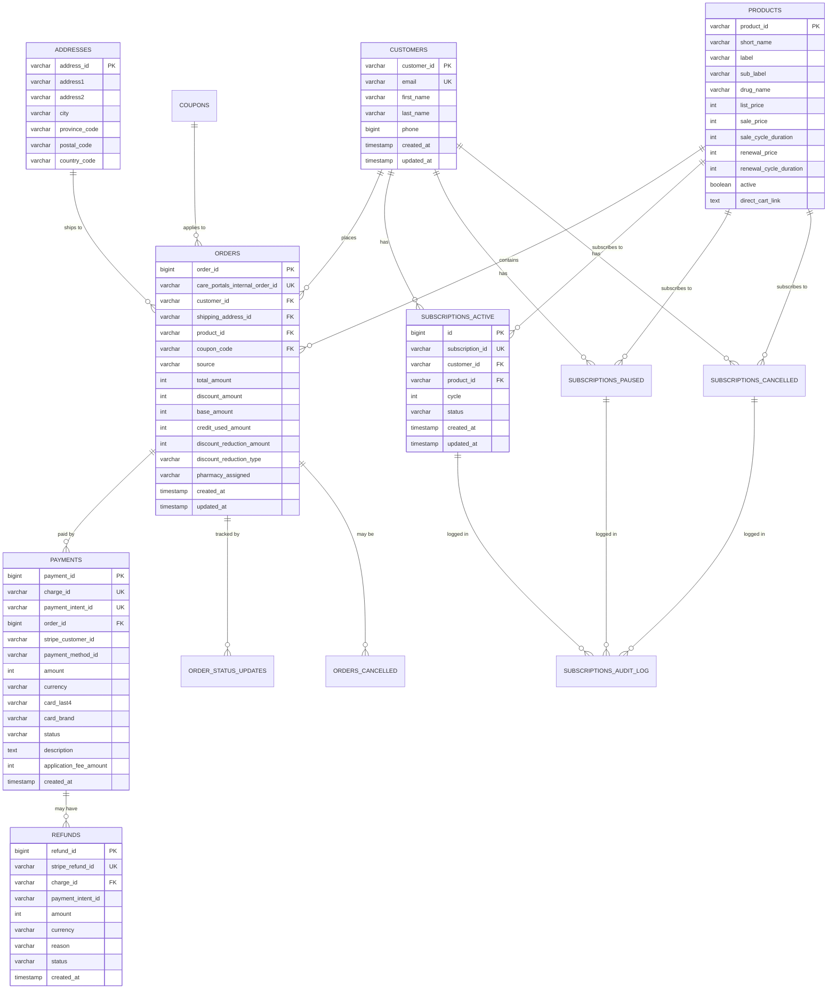
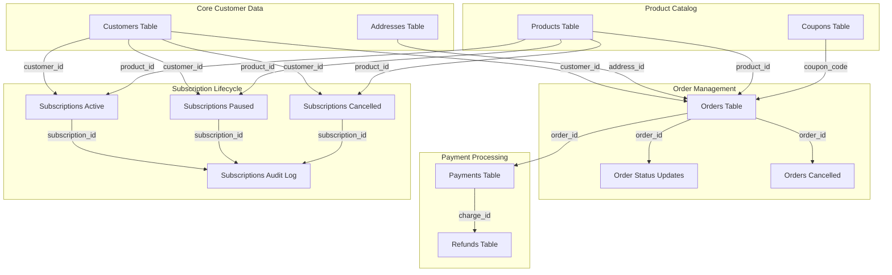

# CarePortals MySQL Database Design Specification

**Version:** 1.0
**Date:** 2025-10-22
**Source:** Database_CarePortals.xlsx
**Purpose:** Complete MySQL schema design for healthcare business data migration

---

## Table of Contents

1. [Executive Summary](#executive-summary)
2. [Database Overview](#database-overview)
3. [Entity Relationship Diagram](#entity-relationship-diagram)
4. [Table Specifications](#table-specifications)
5. [Foreign Key Relationships](#foreign-key-relationships)
6. [Indexes and Performance](#indexes-and-performance)
7. [SQL DDL Statements](#sql-ddl-statements)
8. [Data Migration Strategy](#data-migration-strategy)
9. [Business Rules and Constraints](#business-rules-and-constraints)
10. [Security and Compliance](#security-and-compliance)

---

## Executive Summary

This document specifies the complete MySQL database schema design for the CarePortals healthcare business system, currently implemented in Google Sheets (`Database_CarePortals.xlsx`). The design follows database normalization best practices (3NF), implements proper referential integrity, and optimizes for both transactional and analytical workloads.

### Key Statistics
- **Total Tables:** 16 normalized tables
- **Total Records:** ~5,100+ records
- **Primary Entities:** Customers, Orders, Products, Subscriptions, Payments
- **Real-time Integration:** Stripe webhooks, Order status updates
- **Compliance:** HIPAA-ready with audit trails

### Design Principles
1. **Third Normal Form (3NF)**: Eliminate data redundancy
2. **Referential Integrity**: Enforce all foreign key relationships
3. **Performance Optimization**: Strategic indexing for common queries
4. **Audit Trail**: Complete change tracking for compliance
5. **Scalability**: Designed to handle 10x growth

---

## Database Overview

### Database Structure

```
careportals_db
├── Core Entities (5 tables)
│   ├── customers
│   ├── addresses
│   ├── products
│   ├── coupons
│   └── orders
│
├── Payment System (2 tables)
│   ├── payments
│   └── refunds
│
├── Subscription Management (4 tables)
│   ├── subscriptions_active
│   ├── subscriptions_paused
│   ├── subscriptions_cancelled
│   └── subscriptions_audit_log
│
├── Order Tracking (2 tables)
│   ├── order_status_updates
│   └── orders_cancelled
│
├── Questionnaires (1 table)
│   └── questionnaire_responses
│
└── System Tables (2 tables)
    ├── webhook_logs
    └── error_logs
```

### Storage Engine
- **InnoDB**: All tables use InnoDB for ACID compliance and foreign key support
- **Character Set**: `utf8mb4` for full Unicode support (emojis, international characters)
- **Collation**: `utf8mb4_unicode_ci` for case-insensitive, accent-insensitive comparisons

---

## Entity Relationship Diagram

### High-Level ERD (Mermaid Diagram)



### Detailed Relationship Diagram



---

## Table Specifications

### 1. customers
**Purpose:** Master customer data with email deduplication

| Column | Data Type | Constraints | Description |
|--------|-----------|-------------|-------------|
| customer_id | VARCHAR(255) | PRIMARY KEY | CarePortals customer._id |
| email | VARCHAR(255) | UNIQUE NOT NULL, INDEX | Primary business key |
| first_name | VARCHAR(100) | NOT NULL | Customer first name |
| last_name | VARCHAR(100) | NOT NULL | Customer last name |
| phone | BIGINT | NOT NULL | Contact phone (digits only) |
| created_at | TIMESTAMP | DEFAULT CURRENT_TIMESTAMP | Record creation time |
| updated_at | TIMESTAMP | DEFAULT CURRENT_TIMESTAMP ON UPDATE CURRENT_TIMESTAMP | Last update time |

**Indexes:**
- PRIMARY KEY: `customer_id`
- UNIQUE INDEX: `idx_email` ON `email`
- INDEX: `idx_created_at` ON `created_at`

**Business Rules:**
- Email must be unique across all records
- Phone stored as numeric only (no formatting)
- customer_id matches CarePortals EMR system

---

### 2. addresses
**Purpose:** Normalized shipping addresses with MD5-based deduplication

| Column | Data Type | Constraints | Description |
|--------|-----------|-------------|-------------|
| address_id | CHAR(32) | PRIMARY KEY | MD5 hash of normalized address |
| address1 | VARCHAR(255) | NULL | Street address line 1 |
| address2 | VARCHAR(255) | NULL | Street address line 2 (apt/suite) |
| city | VARCHAR(100) | NULL | City name |
| province_code | CHAR(2) | NULL, INDEX | State/province code (US/CA) |
| postal_code | VARCHAR(20) | NULL, INDEX | ZIP/postal code |
| country_code | CHAR(2) | NULL | ISO country code |

**Indexes:**
- PRIMARY KEY: `address_id`
- INDEX: `idx_province` ON `province_code`
- INDEX: `idx_postal` ON `postal_code`
- INDEX: `idx_province_postal` ON (`province_code`, `postal_code`)

**Business Rules:**
- address_id is MD5 hash of normalized address components
- Normalization: lowercase, street type standardization, special char removal
- Prevents duplicate addresses while preserving original formatting

---

### 3. products
**Purpose:** Product catalog with pricing and subscription details

| Column | Data Type | Constraints | Description |
|--------|-----------|-------------|-------------|
| product_id | VARCHAR(255) | PRIMARY KEY | Product identifier |
| short_name | VARCHAR(100) | NULL | Dashboard display name |
| label | VARCHAR(255) | NULL | Full product name |
| sub_label | VARCHAR(255) | NULL | Product subtitle |
| drug_name | VARCHAR(255) | NOT NULL | Medication compound name |
| list_price | INT | NOT NULL | Original price (cents) |
| sale_price | INT | NULL | Current sale price (cents) |
| sale_cycle_duration | INT | NULL | Prepaid period duration (orders) |
| renewal_price | INT | NULL | Subscription renewal price (cents) |
| renewal_cycle_duration | INT | NOT NULL | Renewal frequency (days) |
| active | BOOLEAN | DEFAULT TRUE | Product availability flag |
| direct_cart_link | TEXT | NULL | Direct purchase URL |
| created_at | TIMESTAMP | DEFAULT CURRENT_TIMESTAMP | Record creation time |
| updated_at | TIMESTAMP | DEFAULT CURRENT_TIMESTAMP ON UPDATE CURRENT_TIMESTAMP | Last update time |

**Indexes:**
- PRIMARY KEY: `product_id`
- INDEX: `idx_active` ON `active`
- INDEX: `idx_short_name` ON `short_name`

**Business Rules:**
- All prices stored in cents (INTEGER)
- sale_cycle_duration = number of prepaid orders before renewal
- renewal_cycle_duration = days between renewal cycles

---

### 4. coupons
**Purpose:** Discount code management

| Column | Data Type | Constraints | Description |
|--------|-----------|-------------|-------------|
| coupon_code | VARCHAR(50) | PRIMARY KEY | Coupon code identifier |
| reduction_amount | INT | NOT NULL | Discount value (cents or percentage) |
| reduction_type | ENUM('dollar','percent') | NULL | Discount type |
| description | TEXT | NOT NULL | Coupon description |
| active | BOOLEAN | DEFAULT TRUE | Coupon validity flag |
| valid_from | TIMESTAMP | NULL | Start date of validity |
| valid_until | TIMESTAMP | NULL | End date of validity |
| created_at | TIMESTAMP | DEFAULT CURRENT_TIMESTAMP | Record creation time |
| updated_at | TIMESTAMP | DEFAULT CURRENT_TIMESTAMP ON UPDATE CURRENT_TIMESTAMP | Last update time |

**Indexes:**
- PRIMARY KEY: `coupon_code`
- INDEX: `idx_active_valid` ON (`active`, `valid_from`, `valid_until`)

**Business Rules:**
- If reduction_type = 'dollar', reduction_amount is in cents
- If reduction_type = 'percent', reduction_amount is 0-100
- Validity dates are optional (NULL = always valid)

---

### 5. orders
**Purpose:** Complete order records with foreign key relationships

| Column | Data Type | Constraints | Description |
|--------|-----------|-------------|-------------|
| order_id | BIGINT | PRIMARY KEY | Customer-facing order ID (4-digit+) |
| care_portals_internal_order_id | VARCHAR(255) | UNIQUE NOT NULL | Internal EMR order ID |
| customer_id | VARCHAR(255) | FOREIGN KEY NOT NULL, INDEX | References customers(customer_id) |
| shipping_address_id | CHAR(32) | FOREIGN KEY NULL, INDEX | References addresses(address_id) |
| product_id | VARCHAR(255) | FOREIGN KEY NULL, INDEX | References products(product_id) |
| coupon_code | VARCHAR(50) | FOREIGN KEY NULL | References coupons(coupon_code) |
| source | VARCHAR(50) | NOT NULL, INDEX | Order source channel |
| total_amount | INT | NOT NULL | Final order total (cents) |
| discount_amount | INT | DEFAULT 0 | Total discounts applied (cents) |
| base_amount | INT | NOT NULL | Pre-discount amount (cents) |
| credit_used_amount | INT | DEFAULT 0 | Store credit applied (cents) |
| discount_reduction_amount | INT | DEFAULT 0 | Line item discount (cents) |
| discount_reduction_type | VARCHAR(20) | NULL | Line item discount type |
| pharmacy_assigned | VARCHAR(50) | NULL, INDEX | Pharmacy routing assignment |
| created_at | TIMESTAMP | NOT NULL, INDEX | Order creation timestamp |
| updated_at | TIMESTAMP | DEFAULT CURRENT_TIMESTAMP ON UPDATE CURRENT_TIMESTAMP | Last update time |

**Indexes:**
- PRIMARY KEY: `order_id`
- UNIQUE INDEX: `idx_internal_order_id` ON `care_portals_internal_order_id`
- INDEX: `idx_customer_id` ON `customer_id`
- INDEX: `idx_product_id` ON `product_id`
- INDEX: `idx_source` ON `source`
- INDEX: `idx_pharmacy` ON `pharmacy_assigned`
- INDEX: `idx_created_at` ON `created_at`
- COMPOSITE INDEX: `idx_customer_created` ON (`customer_id`, `created_at`)

**Foreign Keys:**
- FOREIGN KEY (`customer_id`) REFERENCES `customers`(`customer_id`) ON DELETE RESTRICT ON UPDATE CASCADE
- FOREIGN KEY (`shipping_address_id`) REFERENCES `addresses`(`address_id`) ON DELETE SET NULL ON UPDATE CASCADE
- FOREIGN KEY (`product_id`) REFERENCES `products`(`product_id`) ON DELETE SET NULL ON UPDATE CASCADE
- FOREIGN KEY (`coupon_code`) REFERENCES `coupons`(`coupon_code`) ON DELETE SET NULL ON UPDATE CASCADE

**Business Rules:**
- source values: 'checkout', 'renewal', 'subscription'
- pharmacy_assigned: 'SevenCells' (default), 'Other' (SC/IN states)
- All monetary values in cents

---

### 6. payments
**Purpose:** Stripe payment tracking with real-time webhook processing

| Column | Data Type | Constraints | Description |
|--------|-----------|-------------|-------------|
| payment_id | BIGINT AUTO_INCREMENT | PRIMARY KEY | Internal payment ID |
| charge_id | VARCHAR(255) | UNIQUE NOT NULL, INDEX | Stripe charge ID (ch_* or py_*) |
| payment_intent_id | VARCHAR(255) | UNIQUE NOT NULL, INDEX | Stripe payment intent ID |
| order_id | BIGINT | FOREIGN KEY NOT NULL, INDEX | References orders(order_id) |
| stripe_customer_id | VARCHAR(255) | NOT NULL, INDEX | Stripe customer ID |
| payment_method_id | VARCHAR(255) | NULL | Stripe payment method ID |
| amount | INT | NOT NULL | Payment amount (cents) |
| currency | CHAR(3) | NOT NULL | Currency code (USD) |
| card_last4 | CHAR(4) | NULL | Last 4 digits of card |
| card_brand | VARCHAR(20) | NULL | Card brand (visa, mastercard) |
| status | VARCHAR(20) | NOT NULL, INDEX | Payment status |
| description | TEXT | NULL | Payment description |
| application_fee_amount | INT | DEFAULT 0 | Stripe processing fees (cents) |
| created_at | TIMESTAMP | NOT NULL, INDEX | Payment processing time |
| webhook_received_at | TIMESTAMP | DEFAULT CURRENT_TIMESTAMP | Webhook processing time |

**Indexes:**
- PRIMARY KEY: `payment_id`
- UNIQUE INDEX: `idx_charge_id` ON `charge_id`
- UNIQUE INDEX: `idx_payment_intent` ON `payment_intent_id`
- INDEX: `idx_order_id` ON `order_id`
- INDEX: `idx_stripe_customer` ON `stripe_customer_id`
- INDEX: `idx_status` ON `status`
- INDEX: `idx_created_at` ON `created_at`

**Foreign Keys:**
- FOREIGN KEY (`order_id`) REFERENCES `orders`(`order_id`) ON DELETE RESTRICT ON UPDATE CASCADE

**Business Rules:**
- Real-time webhook processing from Stripe
- charge_id extracted from Stripe webhook payload
- order_id obtained via Stripe metadata API call

---

### 7. refunds
**Purpose:** Stripe refund tracking with real-time webhook processing

| Column | Data Type | Constraints | Description |
|--------|-----------|-------------|-------------|
| refund_id | BIGINT AUTO_INCREMENT | PRIMARY KEY | Internal refund ID |
| stripe_refund_id | VARCHAR(255) | UNIQUE NOT NULL, INDEX | Stripe refund ID (re_*) |
| charge_id | VARCHAR(255) | FOREIGN KEY NOT NULL, INDEX | References payments(charge_id) |
| payment_intent_id | VARCHAR(255) | NOT NULL | Associated payment intent |
| amount | INT | NOT NULL | Refund amount (cents) |
| currency | CHAR(3) | NOT NULL | Currency code (USD) |
| reason | VARCHAR(255) | NULL, INDEX | Refund reason |
| status | VARCHAR(20) | NOT NULL, INDEX | Refund status |
| created_at | TIMESTAMP | NOT NULL, INDEX | Refund creation time |
| webhook_received_at | TIMESTAMP | DEFAULT CURRENT_TIMESTAMP | Webhook processing time |

**Indexes:**
- PRIMARY KEY: `refund_id`
- UNIQUE INDEX: `idx_stripe_refund_id` ON `stripe_refund_id`
- INDEX: `idx_charge_id` ON `charge_id`
- INDEX: `idx_reason` ON `reason`
- INDEX: `idx_status` ON `status`
- INDEX: `idx_created_at` ON `created_at`

**Foreign Keys:**
- FOREIGN KEY (`charge_id`) REFERENCES `payments`(`charge_id`) ON DELETE RESTRICT ON UPDATE CASCADE

**Business Rules:**
- Real-time webhook processing from Stripe
- Partial refunds allowed (amount < original payment)
- Full refund: amount = original payment amount

---

### 8. subscriptions_active
**Purpose:** Currently active subscription records

| Column | Data Type | Constraints | Description |
|--------|-----------|-------------|-------------|
| id | BIGINT AUTO_INCREMENT | PRIMARY KEY | Internal subscription record ID |
| subscription_id | VARCHAR(255) | UNIQUE NOT NULL, INDEX | Customer-facing subscription ID |
| customer_id | VARCHAR(255) | FOREIGN KEY NULL, INDEX | References customers(customer_id) |
| product_id | VARCHAR(255) | FOREIGN KEY NULL, INDEX | References products(product_id) |
| cycle | INT | NOT NULL | Current subscription cycle number |
| status | VARCHAR(20) | NOT NULL | Subscription status (active) |
| created_at | TIMESTAMP | NOT NULL, INDEX | Subscription creation time |
| updated_at | TIMESTAMP | NULL | Last modification time |

**Indexes:**
- PRIMARY KEY: `id`
- UNIQUE INDEX: `idx_subscription_id` ON `subscription_id`
- INDEX: `idx_customer_id` ON `customer_id`
- INDEX: `idx_product_id` ON `product_id`
- INDEX: `idx_created_at` ON `created_at`
- COMPOSITE INDEX: `idx_customer_product` ON (`customer_id`, `product_id`)

**Foreign Keys:**
- FOREIGN KEY (`customer_id`) REFERENCES `customers`(`customer_id`) ON DELETE SET NULL ON UPDATE CASCADE
- FOREIGN KEY (`product_id`) REFERENCES `products`(`product_id`) ON DELETE SET NULL ON UPDATE CASCADE

**Business Rules:**
- status always = 'active' in this table
- cycle starts at 1, increments with each renewal
- Moved to paused/cancelled tables when status changes

---

### 9. subscriptions_paused
**Purpose:** Temporarily paused subscription records

**Schema:** Identical to `subscriptions_active` with `status = 'paused'`

**Business Rules:**
- Records moved here from subscriptions_active when paused
- Can be reactivated (moved back to subscriptions_active)
- Billing paused, but relationship preserved

---

### 10. subscriptions_cancelled
**Purpose:** Cancelled subscription records for churn analysis

**Schema:** Identical to `subscriptions_active` with `status = 'cancelled'`

**Business Rules:**
- Records moved here from subscriptions_active when cancelled
- Permanent status change (typically not reversible)
- Used for churn rate calculations and retention analysis

---

### 11. subscriptions_audit_log
**Purpose:** Complete subscription lifecycle audit trail

| Column | Data Type | Constraints | Description |
|--------|-----------|-------------|-------------|
| log_id | BIGINT AUTO_INCREMENT | PRIMARY KEY | Audit log entry ID |
| subscription_id | VARCHAR(255) | NOT NULL, INDEX | Subscription identifier |
| customer_id | VARCHAR(255) | NULL, INDEX | Customer identifier |
| product_id | VARCHAR(255) | NULL | Product identifier |
| cycle | INT | NOT NULL | Subscription cycle at event |
| status | VARCHAR(20) | NOT NULL, INDEX | Subscription status |
| trigger_type | VARCHAR(50) | NOT NULL, INDEX | Event that triggered log |
| created_at | TIMESTAMP | NOT NULL | Original subscription creation |
| updated_at | TIMESTAMP | NOT NULL | Update timestamp |
| webhook_received_at | TIMESTAMP | DEFAULT CURRENT_TIMESTAMP, INDEX | Webhook processing time |
| raw_data | JSON | NULL | Complete webhook payload |

**Indexes:**
- PRIMARY KEY: `log_id`
- INDEX: `idx_subscription_id` ON `subscription_id`
- INDEX: `idx_customer_id` ON `customer_id`
- INDEX: `idx_status` ON `status`
- INDEX: `idx_trigger_type` ON `trigger_type`
- INDEX: `idx_webhook_received` ON `webhook_received_at`
- COMPOSITE INDEX: `idx_subscription_received` ON (`subscription_id`, `webhook_received_at`)

**Business Rules:**
- Immutable audit trail (INSERT only, no UPDATE/DELETE)
- Records every subscription state change
- raw_data stores complete webhook for debugging
- Used for compliance and churn analysis

---

### 12. order_status_updates
**Purpose:** Real-time order status tracking and lifecycle management

| Column | Data Type | Constraints | Description |
|--------|-----------|-------------|-------------|
| update_id | BIGINT AUTO_INCREMENT | PRIMARY KEY | Status update record ID |
| order_id | BIGINT | FOREIGN KEY NOT NULL, INDEX | References orders(order_id) |
| updated_status | VARCHAR(50) | NOT NULL, INDEX | New order status |
| order_created_at | TIMESTAMP | NOT NULL | Original order creation |
| status_updated_at | TIMESTAMP | NOT NULL, INDEX | Status change timestamp |
| webhook_received_at | TIMESTAMP | DEFAULT CURRENT_TIMESTAMP | Webhook processing time |

**Indexes:**
- PRIMARY KEY: `update_id`
- INDEX: `idx_order_id` ON `order_id`
- INDEX: `idx_updated_status` ON `updated_status`
- INDEX: `idx_status_updated_at` ON `status_updated_at`
- COMPOSITE INDEX: `idx_order_status_time` ON (`order_id`, `status_updated_at`)

**Foreign Keys:**
- FOREIGN KEY (`order_id`) REFERENCES `orders`(`order_id`) ON DELETE CASCADE ON UPDATE CASCADE

**Business Rules:**
- Real-time webhook from CarePortals order.status_updated events
- Status values: awaiting_payment, awaiting_script, awaiting_shipment, shipped, delivered, cancelled, refunded
- Complete audit trail of order lifecycle
- Used for processing efficiency KPI calculations

---

### 13. orders_cancelled
**Purpose:** Cancelled order tracking

| Column | Data Type | Constraints | Description |
|--------|-----------|-------------|-------------|
| cancellation_id | BIGINT AUTO_INCREMENT | PRIMARY KEY | Cancellation record ID |
| order_id | BIGINT | FOREIGN KEY NOT NULL, UNIQUE, INDEX | References orders(order_id) |
| cancelled_at | TIMESTAMP | NOT NULL, INDEX | Cancellation timestamp |

**Indexes:**
- PRIMARY KEY: `cancellation_id`
- UNIQUE INDEX: `idx_order_id` ON `order_id`
- INDEX: `idx_cancelled_at` ON `cancelled_at`

**Foreign Keys:**
- FOREIGN KEY (`order_id`) REFERENCES `orders`(`order_id`) ON DELETE CASCADE ON UPDATE CASCADE

**Business Rules:**
- One cancellation per order (UNIQUE constraint)
- Supplements order_status_updates with explicit cancellation tracking

---

### 14. questionnaire_responses
**Purpose:** Questionnaire form structure and answer data

| Column | Data Type | Constraints | Description |
|--------|-----------|-------------|-------------|
| response_id | BIGINT AUTO_INCREMENT | PRIMARY KEY | Response record ID |
| questionnaire_id | VARCHAR(100) | NOT NULL, INDEX | Questionnaire identifier |
| session_id | VARCHAR(100) | NOT NULL, INDEX | Form session ID |
| question_index | INT | NOT NULL | Question position |
| question_type | VARCHAR(50) | NOT NULL | Question type |
| answer_data_type | VARCHAR(50) | NOT NULL | Answer format |
| answer_count | INT | NOT NULL | Number of answers |
| answers | JSON | NULL | Answer content |
| composite_key | VARCHAR(255) | NOT NULL, INDEX | Unique question identifier |
| created_at | TIMESTAMP | DEFAULT CURRENT_TIMESTAMP, INDEX | Response timestamp |

**Indexes:**
- PRIMARY KEY: `response_id`
- INDEX: `idx_questionnaire_id` ON `questionnaire_id`
- INDEX: `idx_session_id` ON `session_id`
- INDEX: `idx_composite_key` ON `composite_key`
- INDEX: `idx_created_at` ON `created_at`
- COMPOSITE INDEX: `idx_questionnaire_session` ON (`questionnaire_id`, `session_id`)

**Business Rules:**
- Stores patient questionnaire responses
- JSON format for flexible answer types
- composite_key format: questionnaire_id|question_index|question_type

---

### 15. webhook_logs
**Purpose:** System webhook processing audit trail

| Column | Data Type | Constraints | Description |
|--------|-----------|-------------|-------------|
| log_id | BIGINT AUTO_INCREMENT | PRIMARY KEY | Log entry ID |
| webhook_type | VARCHAR(50) | NOT NULL, INDEX | Type of webhook event |
| source_system | VARCHAR(50) | NOT NULL | Source (Stripe, CarePortals) |
| event_id | VARCHAR(255) | NULL, INDEX | External event identifier |
| status | ENUM('success','failed','pending') | NOT NULL, INDEX | Processing status |
| error_message | TEXT | NULL | Error details if failed |
| payload | JSON | NULL | Complete webhook payload |
| processing_time_ms | INT | NULL | Processing duration |
| received_at | TIMESTAMP | DEFAULT CURRENT_TIMESTAMP, INDEX | Webhook receipt time |

**Indexes:**
- PRIMARY KEY: `log_id`
- INDEX: `idx_webhook_type` ON `webhook_type`
- INDEX: `idx_source_system` ON `source_system`
- INDEX: `idx_event_id` ON `event_id`
- INDEX: `idx_status` ON `status`
- INDEX: `idx_received_at` ON `received_at`
- COMPOSITE INDEX: `idx_type_status_received` ON (`webhook_type`, `status`, `received_at`)

**Business Rules:**
- Immutable audit log (INSERT only)
- Records all webhook activity for debugging
- performance monitoring via processing_time_ms

---

### 16. error_logs
**Purpose:** System error tracking and debugging

| Column | Data Type | Constraints | Description |
|--------|-----------|-------------|-------------|
| error_id | BIGINT AUTO_INCREMENT | PRIMARY KEY | Error record ID |
| error_type | VARCHAR(100) | NOT NULL, INDEX | Error classification |
| error_message | TEXT | NOT NULL | Detailed error description |
| raw_data | JSON | NULL | Data that caused error |
| trigger_source | VARCHAR(100) | NULL, INDEX | Event/process that triggered error |
| stack_trace | TEXT | NULL | Error stack trace |
| occurred_at | TIMESTAMP | DEFAULT CURRENT_TIMESTAMP, INDEX | Error occurrence time |

**Indexes:**
- PRIMARY KEY: `error_id`
- INDEX: `idx_error_type` ON `error_type`
- INDEX: `idx_trigger_source` ON `trigger_source`
- INDEX: `idx_occurred_at` ON `occurred_at`

**Business Rules:**
- Immutable log (INSERT only)
- Used for debugging and system health monitoring

---

## Foreign Key Relationships

### Relationship Map

```
CUSTOMERS (customer_id)
    ├─→ ORDERS (customer_id)
    ├─→ SUBSCRIPTIONS_ACTIVE (customer_id)
    ├─→ SUBSCRIPTIONS_PAUSED (customer_id)
    └─→ SUBSCRIPTIONS_CANCELLED (customer_id)

ADDRESSES (address_id)
    └─→ ORDERS (shipping_address_id)

PRODUCTS (product_id)
    ├─→ ORDERS (product_id)
    ├─→ SUBSCRIPTIONS_ACTIVE (product_id)
    ├─→ SUBSCRIPTIONS_PAUSED (product_id)
    └─→ SUBSCRIPTIONS_CANCELLED (product_id)

COUPONS (coupon_code)
    └─→ ORDERS (coupon_code)

ORDERS (order_id)
    ├─→ PAYMENTS (order_id)
    ├─→ ORDER_STATUS_UPDATES (order_id)
    └─→ ORDERS_CANCELLED (order_id)

PAYMENTS (charge_id)
    └─→ REFUNDS (charge_id)
```

### Foreign Key Actions

| Parent Table | Child Table | ON DELETE | ON UPDATE | Reason |
|--------------|-------------|-----------|-----------|--------|
| customers | orders | RESTRICT | CASCADE | Prevent orphaned orders |
| customers | subscriptions_* | SET NULL | CASCADE | Allow customer data cleanup |
| addresses | orders | SET NULL | CASCADE | Address optional, allow cleanup |
| products | orders | SET NULL | CASCADE | Product optional, allow catalog changes |
| products | subscriptions_* | SET NULL | CASCADE | Product optional, allow catalog changes |
| coupons | orders | SET NULL | CASCADE | Coupon optional, allow removal |
| orders | payments | RESTRICT | CASCADE | Preserve payment history |
| orders | order_status_updates | CASCADE | CASCADE | Delete tracking with order |
| orders | orders_cancelled | CASCADE | CASCADE | Delete cancellation with order |
| payments | refunds | RESTRICT | CASCADE | Preserve refund history |

---

## Indexes and Performance

### Indexing Strategy

#### 1. **Primary Key Indexes** (AUTO_INCREMENT where applicable)
All tables have clustered primary key indexes for fast row lookup.

#### 2. **Foreign Key Indexes**
All foreign key columns are indexed for:
- Fast JOIN operations
- Referential integrity checks
- CASCADE/SET NULL performance

#### 3. **Temporal Indexes**
All `created_at` and `updated_at` columns indexed for:
- Date range queries
- Time-series analysis
- Report generation

#### 4. **Business Key Indexes**
- `customers.email` (UNIQUE) - Primary business identifier
- `orders.care_portals_internal_order_id` (UNIQUE) - EMR system integration
- `payments.charge_id`, `payment_intent_id` (UNIQUE) - Stripe integration
- `refunds.stripe_refund_id` (UNIQUE) - Stripe integration

#### 5. **Composite Indexes** (Multi-column)
Optimized for common query patterns:

```sql
-- Customer order history queries
CREATE INDEX idx_customer_created ON orders (customer_id, created_at);

-- Subscription lookup by customer and product
CREATE INDEX idx_customer_product ON subscriptions_active (customer_id, product_id);

-- Geographic analysis
CREATE INDEX idx_province_postal ON addresses (province_code, postal_code);

-- Order status timeline
CREATE INDEX idx_order_status_time ON order_status_updates (order_id, status_updated_at);

-- Subscription audit queries
CREATE INDEX idx_subscription_received ON subscriptions_audit_log (subscription_id, webhook_received_at);

-- Webhook monitoring
CREATE INDEX idx_type_status_received ON webhook_logs (webhook_type, status, received_at);
```

### Query Optimization Examples

#### Example 1: Customer CLV Calculation
```sql
-- Optimized query using composite index
SELECT
    c.customer_id,
    c.email,
    SUM(o.total_amount) as lifetime_value
FROM customers c
INNER JOIN orders o ON c.customer_id = o.customer_id
WHERE o.created_at >= '2024-01-01'
GROUP BY c.customer_id, c.email;

-- Uses: idx_customer_created composite index
```

#### Example 2: Order Processing Efficiency
```sql
-- Optimized with index on order_status_updates
SELECT
    os1.order_id,
    TIMESTAMPDIFF(HOUR, os1.status_updated_at, os2.status_updated_at) as processing_hours
FROM order_status_updates os1
INNER JOIN order_status_updates os2
    ON os1.order_id = os2.order_id
WHERE os1.updated_status = 'awaiting_script'
  AND os2.updated_status = 'shipped'
  AND os1.status_updated_at >= DATE_SUB(NOW(), INTERVAL 30 DAY);

-- Uses: idx_order_status_time composite index
```

#### Example 3: Geographic Reach
```sql
-- Optimized geographic query
SELECT
    a.province_code,
    COUNT(DISTINCT o.customer_id) as customer_count,
    COUNT(o.order_id) as order_count
FROM addresses a
INNER JOIN orders o ON a.address_id = o.shipping_address_id
WHERE o.created_at >= DATE_SUB(NOW(), INTERVAL 30 DAY)
GROUP BY a.province_code
ORDER BY customer_count DESC;

-- Uses: idx_province_postal and idx_created_at indexes
```

### Performance Tuning Recommendations

1. **Regular ANALYZE TABLE**
   ```sql
   ANALYZE TABLE orders, payments, subscriptions_active;
   ```

2. **Monitor Slow Query Log**
   ```sql
   SET GLOBAL slow_query_log = 'ON';
   SET GLOBAL long_query_time = 2;
   ```

3. **Use EXPLAIN for Complex Queries**
   ```sql
   EXPLAIN SELECT ... FROM orders WHERE ...;
   ```

4. **Partition Large Tables** (if needed)
   ```sql
   -- Partition orders by year for very large datasets
   ALTER TABLE orders PARTITION BY RANGE (YEAR(created_at)) (
       PARTITION p2023 VALUES LESS THAN (2024),
       PARTITION p2024 VALUES LESS THAN (2025),
       PARTITION p2025 VALUES LESS THAN (2026)
   );
   ```

---

## SQL DDL Statements

### Database Creation

```sql
CREATE DATABASE IF NOT EXISTS careportals_db
CHARACTER SET utf8mb4
COLLATE utf8mb4_unicode_ci;

USE careportals_db;
```

### Table Creation (Complete DDL)

Due to length, the complete DDL is provided in a separate file: `CAREPORTALS_MYSQL_DDL.sql`

Key DDL highlights will be shown here:

#### customers Table
```sql
CREATE TABLE customers (
    customer_id VARCHAR(255) NOT NULL,
    email VARCHAR(255) NOT NULL,
    first_name VARCHAR(100) NOT NULL,
    last_name VARCHAR(100) NOT NULL,
    phone BIGINT NOT NULL,
    created_at TIMESTAMP NOT NULL DEFAULT CURRENT_TIMESTAMP,
    updated_at TIMESTAMP NOT NULL DEFAULT CURRENT_TIMESTAMP ON UPDATE CURRENT_TIMESTAMP,

    PRIMARY KEY (customer_id),
    UNIQUE KEY idx_email (email),
    KEY idx_created_at (created_at)
) ENGINE=InnoDB DEFAULT CHARSET=utf8mb4 COLLATE=utf8mb4_unicode_ci;
```

#### orders Table with Foreign Keys
```sql
CREATE TABLE orders (
    order_id BIGINT NOT NULL,
    care_portals_internal_order_id VARCHAR(255) NOT NULL,
    customer_id VARCHAR(255) NOT NULL,
    shipping_address_id CHAR(32) NULL,
    product_id VARCHAR(255) NULL,
    coupon_code VARCHAR(50) NULL,
    source VARCHAR(50) NOT NULL,
    total_amount INT NOT NULL,
    discount_amount INT NOT NULL DEFAULT 0,
    base_amount INT NOT NULL,
    credit_used_amount INT NOT NULL DEFAULT 0,
    discount_reduction_amount INT NOT NULL DEFAULT 0,
    discount_reduction_type VARCHAR(20) NULL,
    pharmacy_assigned VARCHAR(50) NULL,
    created_at TIMESTAMP NOT NULL,
    updated_at TIMESTAMP NOT NULL DEFAULT CURRENT_TIMESTAMP ON UPDATE CURRENT_TIMESTAMP,

    PRIMARY KEY (order_id),
    UNIQUE KEY idx_internal_order_id (care_portals_internal_order_id),
    KEY idx_customer_id (customer_id),
    KEY idx_product_id (product_id),
    KEY idx_source (source),
    KEY idx_pharmacy (pharmacy_assigned),
    KEY idx_created_at (created_at),
    KEY idx_customer_created (customer_id, created_at),

    CONSTRAINT fk_orders_customer
        FOREIGN KEY (customer_id)
        REFERENCES customers(customer_id)
        ON DELETE RESTRICT
        ON UPDATE CASCADE,

    CONSTRAINT fk_orders_address
        FOREIGN KEY (shipping_address_id)
        REFERENCES addresses(address_id)
        ON DELETE SET NULL
        ON UPDATE CASCADE,

    CONSTRAINT fk_orders_product
        FOREIGN KEY (product_id)
        REFERENCES products(product_id)
        ON DELETE SET NULL
        ON UPDATE CASCADE,

    CONSTRAINT fk_orders_coupon
        FOREIGN KEY (coupon_code)
        REFERENCES coupons(coupon_code)
        ON DELETE SET NULL
        ON UPDATE CASCADE
) ENGINE=InnoDB DEFAULT CHARSET=utf8mb4 COLLATE=utf8mb4_unicode_ci;
```

---

## Data Migration Strategy

### Phase 1: Schema Creation
1. Create database and all tables (DDL execution)
2. Verify foreign key constraints
3. Validate indexes creation

### Phase 2: Static Data Migration
**Order of migration (respects foreign keys):**

1. **customers** (no dependencies)
2. **addresses** (no dependencies)
3. **products** (no dependencies)
4. **coupons** (no dependencies)
5. **orders** (depends on customers, addresses, products, coupons)
6. **payments** (depends on orders)
7. **refunds** (depends on payments)
8. **subscriptions_*** (depends on customers, products)
9. **order_status_updates** (depends on orders)
10. **orders_cancelled** (depends on orders)
11. **questionnaire_responses** (no dependencies)
12. **subscriptions_audit_log** (depends on subscriptions)

### Phase 3: Data Transformation

#### Address Normalization
```python
import hashlib

def normalize_address(address1, address2, city, province, postal):
    # Normalize components
    components = [
        normalize_street(address1 or ''),
        normalize_street(address2 or ''),
        (city or '').lower().strip(),
        (province or '').lower().strip(),
        (postal or '').lower().replace(' ', '')
    ]

    # Create hash
    address_string = '|'.join(components)
    return hashlib.md5(address_string.encode()).hexdigest()

def normalize_street(street):
    replacements = {
        ' st ': ' street ',
        ' ave ': ' avenue ',
        ' rd ': ' road ',
        ' blvd ': ' boulevard ',
        ' dr ': ' drive '
    }
    street = street.lower().strip()
    for old, new in replacements.items():
        street = street.replace(old, new)
    return street
```

#### Price Conversion
```python
def dollars_to_cents(dollar_value):
    """Convert dollar amounts to cents (INTEGER)"""
    if dollar_value is None:
        return None
    return int(round(float(dollar_value) * 100))
```

#### Timestamp Normalization
```python
from datetime import datetime
import pytz

def normalize_timestamp(timestamp_str, timezone='US/Eastern'):
    """Ensure all timestamps are in UTC for MySQL"""
    if not timestamp_str:
        return None

    # Parse timestamp
    dt = datetime.fromisoformat(timestamp_str)

    # Localize to Eastern Time if naive
    if dt.tzinfo is None:
        eastern = pytz.timezone(timezone)
        dt = eastern.localize(dt)

    # Convert to UTC
    utc_dt = dt.astimezone(pytz.UTC)

    # Return MySQL-compatible format
    return utc_dt.strftime('%Y-%m-%d %H:%M:%S')
```

### Phase 4: Data Validation

```sql
-- Validate referential integrity
SELECT 'Orders with invalid customer_id' as issue, COUNT(*) as count
FROM orders o
LEFT JOIN customers c ON o.customer_id = c.customer_id
WHERE c.customer_id IS NULL;

-- Validate payment totals
SELECT 'Payment amount mismatches' as issue, COUNT(*) as count
FROM orders o
INNER JOIN payments p ON o.order_id = p.order_id
WHERE o.total_amount != p.amount;

-- Validate address relationships
SELECT 'Orders with invalid address_id' as issue, COUNT(*) as count
FROM orders o
LEFT JOIN addresses a ON o.shipping_address_id = a.address_id
WHERE o.shipping_address_id IS NOT NULL
  AND a.address_id IS NULL;
```

### Phase 5: Ongoing Sync Strategy

#### Real-time Webhook Integration
- Update Google Apps Script webhooks to write to MySQL instead of Sheets
- Dual-write period: Write to both Sheets and MySQL for validation
- Cutover: Switch to MySQL as primary, Sheets as backup

#### Batch Sync (Transition Period)
```python
# Daily sync script
def sync_google_sheets_to_mysql():
    # Connect to both sources
    sheets_data = fetch_from_google_sheets()
    mysql_conn = connect_to_mysql()

    # Sync each table
    for table_name in SYNC_TABLES:
        upsert_data(
            mysql_conn,
            table_name,
            sheets_data[table_name],
            conflict_strategy='update'
        )
```

---

## Business Rules and Constraints

### Data Integrity Constraints

#### 1. Customer Uniqueness
```sql
-- Email must be unique
ALTER TABLE customers ADD CONSTRAINT unique_email UNIQUE (email);

-- Prevent duplicate customers with same email
CREATE TRIGGER prevent_duplicate_email
BEFORE INSERT ON customers
FOR EACH ROW
BEGIN
    IF EXISTS (SELECT 1 FROM customers WHERE email = NEW.email) THEN
        SIGNAL SQLSTATE '45000'
        SET MESSAGE_TEXT = 'Customer with this email already exists';
    END IF;
END;
```

#### 2. Order Amount Validation
```sql
-- Ensure amounts are non-negative
ALTER TABLE orders ADD CONSTRAINT check_total_amount CHECK (total_amount >= 0);
ALTER TABLE orders ADD CONSTRAINT check_base_amount CHECK (base_amount >= 0);

-- Validate discount logic
ALTER TABLE orders ADD CONSTRAINT check_discount_logic
    CHECK (total_amount = base_amount - discount_amount + credit_used_amount);
```

#### 3. Subscription Cycle Progression
```sql
-- Cycle must be positive
ALTER TABLE subscriptions_active ADD CONSTRAINT check_cycle CHECK (cycle > 0);

-- Prevent cycle regression (trigger)
CREATE TRIGGER validate_subscription_cycle
BEFORE UPDATE ON subscriptions_active
FOR EACH ROW
BEGIN
    IF NEW.cycle < OLD.cycle THEN
        SIGNAL SQLSTATE '45000'
        SET MESSAGE_TEXT = 'Subscription cycle cannot decrease';
    END IF;
END;
```

#### 4. Payment-Order Relationship
```sql
-- Payment amount must match order total (warning only, for investigation)
CREATE TRIGGER check_payment_amount_match
AFTER INSERT ON payments
FOR EACH ROW
BEGIN
    DECLARE order_total INT;

    SELECT total_amount INTO order_total
    FROM orders
    WHERE order_id = NEW.order_id;

    IF NEW.amount != order_total THEN
        INSERT INTO error_logs (error_type, error_message, raw_data)
        VALUES (
            'payment_amount_mismatch',
            CONCAT('Payment amount ', NEW.amount, ' does not match order total ', order_total),
            JSON_OBJECT('payment_id', NEW.payment_id, 'order_id', NEW.order_id)
        );
    END IF;
END;
```

### Business Logic Constraints

#### 1. Pharmacy Assignment Rules
```sql
-- Automatically assign pharmacy based on state
CREATE TRIGGER assign_pharmacy
BEFORE INSERT ON orders
FOR EACH ROW
BEGIN
    DECLARE state_code CHAR(2);

    IF NEW.shipping_address_id IS NOT NULL THEN
        SELECT province_code INTO state_code
        FROM addresses
        WHERE address_id = NEW.shipping_address_id;

        IF state_code IN ('SC', 'IN') THEN
            SET NEW.pharmacy_assigned = 'Other';
        ELSE
            SET NEW.pharmacy_assigned = 'SevenCells';
        END IF;
    END IF;
END;
```

#### 2. Subscription Status Transitions
```sql
-- Valid status transitions
CREATE TABLE subscription_status_transitions (
    from_status VARCHAR(20) NOT NULL,
    to_status VARCHAR(20) NOT NULL,
    allowed BOOLEAN NOT NULL DEFAULT TRUE,
    PRIMARY KEY (from_status, to_status)
);

INSERT INTO subscription_status_transitions (from_status, to_status) VALUES
    ('active', 'paused'),
    ('active', 'cancelled'),
    ('paused', 'active'),
    ('paused', 'cancelled');

-- Enforce with trigger
CREATE TRIGGER validate_subscription_status_change
BEFORE UPDATE ON subscriptions_active
FOR EACH ROW
BEGIN
    IF NEW.status != OLD.status THEN
        IF NOT EXISTS (
            SELECT 1 FROM subscription_status_transitions
            WHERE from_status = OLD.status AND to_status = NEW.status AND allowed = TRUE
        ) THEN
            SIGNAL SQLSTATE '45000'
            SET MESSAGE_TEXT = 'Invalid subscription status transition';
        END IF;
    END IF;
END;
```

---

## Security and Compliance

### HIPAA Compliance Features

#### 1. Audit Trail
All tables include `created_at` and `updated_at` timestamps for complete audit trail.

Additional audit tables:
- `subscriptions_audit_log`: Complete subscription lifecycle
- `webhook_logs`: All system interactions
- `error_logs`: System health monitoring

#### 2. Data Encryption
```sql
-- Enable encryption at rest
ALTER TABLE customers ENCRYPTION='Y';
ALTER TABLE orders ENCRYPTION='Y';
ALTER TABLE payments ENCRYPTION='Y';
ALTER TABLE refunds ENCRYPTION='Y';
ALTER TABLE subscriptions_active ENCRYPTION='Y';
```

#### 3. Access Control
```sql
-- Create application user with limited permissions
CREATE USER 'careportals_app'@'%' IDENTIFIED BY 'SECURE_PASSWORD_HERE';

-- Grant only necessary privileges
GRANT SELECT, INSERT, UPDATE ON careportals_db.* TO 'careportals_app'@'%';

-- Prevent DELETE on critical tables
REVOKE DELETE ON careportals_db.payments FROM 'careportals_app'@'%';
REVOKE DELETE ON careportals_db.refunds FROM 'careportals_app'@'%';
REVOKE DELETE ON careportals_db.subscriptions_audit_log FROM 'careportals_app'@'%';
REVOKE DELETE ON careportals_db.webhook_logs FROM 'careportals_app'@'%';

-- Create read-only analyst user
CREATE USER 'careportals_analyst'@'%' IDENTIFIED BY 'SECURE_PASSWORD_HERE';
GRANT SELECT ON careportals_db.* TO 'careportals_analyst'@'%';

-- Create admin user for migrations
CREATE USER 'careportals_admin'@'localhost' IDENTIFIED BY 'SECURE_PASSWORD_HERE';
GRANT ALL PRIVILEGES ON careportals_db.* TO 'careportals_admin'@'localhost';
```

#### 4. Data Retention Policies
```sql
-- Archive old audit logs (90 day retention)
CREATE EVENT archive_webhook_logs
ON SCHEDULE EVERY 1 DAY
DO
    DELETE FROM webhook_logs
    WHERE received_at < DATE_SUB(NOW(), INTERVAL 90 DAY);

-- Archive old error logs (30 day retention)
CREATE EVENT archive_error_logs
ON SCHEDULE EVERY 1 DAY
DO
    DELETE FROM error_logs
    WHERE occurred_at < DATE_SUB(NOW(), INTERVAL 30 DAY);
```

### Backup Strategy

#### 1. Daily Backups
```bash
# Full database backup
mysqldump --single-transaction \
          --routines \
          --triggers \
          --events \
          --databases careportals_db \
          > careportals_backup_$(date +%Y%m%d).sql

# Compress
gzip careportals_backup_$(date +%Y%m%d).sql
```

#### 2. Point-in-Time Recovery
```sql
-- Enable binary logging
SET GLOBAL binlog_format = 'ROW';
SET GLOBAL binlog_row_image = 'FULL';
```

#### 3. Replication (Optional)
```sql
-- Master configuration
[mysqld]
server-id = 1
log-bin = mysql-bin
binlog-do-db = careportals_db

-- Slave configuration
[mysqld]
server-id = 2
relay-log = mysql-relay-bin
```

---

## Appendix

### Glossary

- **CLV (Customer Lifetime Value)**: Total revenue expected from a customer
- **ARPU (Average Revenue Per User)**: Monthly revenue per customer
- **Churn Rate**: Percentage of customers who cancel subscriptions
- **MRR (Monthly Recurring Revenue)**: Predictable monthly revenue from subscriptions
- **Webhook**: Real-time HTTP callback for event notifications
- **3NF (Third Normal Form)**: Database normalization level eliminating transitive dependencies

### Related Documentation

- `DATABASE_CAREPORTALS_SCHEMA.md`: Current Google Sheets structure
- `CAREPORTALS_MYSQL_DDL.sql`: Complete SQL DDL statements
- `CAREPORTALS_MYSQL_MIGRATION.py`: Python migration scripts
- `KPI_DEFINITIONS_GUIDE.md`: Business metrics documentation

### Version History

| Version | Date | Changes | Author |
|---------|------|---------|--------|
| 1.0 | 2025-10-22 | Initial MySQL design specification | Claude Code |

---

**Document Status:** Draft for Review
**Next Steps:**
1. Review with stakeholders
2. Generate complete DDL SQL file
3. Create Python migration scripts
4. Set up test environment
5. Execute test migration
6. Performance testing
7. Production deployment planning

---

**End of Document**
