# CarePortals MySQL Database - Entity Relationship Diagrams

**Version:** 1.0
**Date:** 2025-10-22
**Purpose:** Visual representation of database structure and relationships

---

## Table of Contents

1. [Complete ERD - All Tables](#complete-erd---all-tables)
2. [Core Business Entities](#core-business-entities)
3. [Order Management Flow](#order-management-flow)
4. [Payment Processing Flow](#payment-processing-flow)
5. [Subscription Lifecycle](#subscription-lifecycle)
6. [Cardinality and Relationship Details](#cardinality-and-relationship-details)

---

## Complete ERD - All Tables

### Comprehensive Entity Relationship Diagram

```mermaid
erDiagram
    %% Core Entities
    CUSTOMERS ||--o{ ORDERS : "places"
    CUSTOMERS ||--o{ SUBSCRIPTIONS_ACTIVE : "has"
    CUSTOMERS ||--o{ SUBSCRIPTIONS_PAUSED : "has"
    CUSTOMERS ||--o{ SUBSCRIPTIONS_CANCELLED : "has"

    ADDRESSES ||--o{ ORDERS : "ships_to"
    PRODUCTS ||--o{ ORDERS : "contains"
    PRODUCTS ||--o{ SUBSCRIPTIONS_ACTIVE : "subscribes_to"
    PRODUCTS ||--o{ SUBSCRIPTIONS_PAUSED : "subscribes_to"
    PRODUCTS ||--o{ SUBSCRIPTIONS_CANCELLED : "subscribes_to"
    COUPONS ||--o{ ORDERS : "discounts"

    %% Order Processing
    ORDERS ||--o{ PAYMENTS : "paid_by"
    ORDERS ||--o{ ORDER_STATUS_UPDATES : "tracked_by"
    ORDERS ||--o| ORDERS_CANCELLED : "may_be_cancelled"

    %% Payment Processing
    PAYMENTS ||--o{ REFUNDS : "may_have_refunds"

    %% Audit Trails
    SUBSCRIPTIONS_ACTIVE }o--o{ SUBSCRIPTIONS_AUDIT_LOG : "logged"
    SUBSCRIPTIONS_PAUSED }o--o{ SUBSCRIPTIONS_AUDIT_LOG : "logged"
    SUBSCRIPTIONS_CANCELLED }o--o{ SUBSCRIPTIONS_AUDIT_LOG : "logged"

    CUSTOMERS {
        varchar customer_id PK "CarePortals ID"
        varchar email UK "Business Key"
        varchar first_name
        varchar last_name
        bigint phone
        timestamp created_at
        timestamp updated_at
    }

    ADDRESSES {
        char address_id PK "MD5 Hash"
        varchar address1
        varchar address2
        varchar city
        char province_code "State"
        varchar postal_code "ZIP"
        char country_code "ISO Code"
    }

    PRODUCTS {
        varchar product_id PK
        varchar short_name "Dashboard Name"
        varchar label "Full Name"
        varchar drug_name "Medication"
        int list_price "Cents"
        int sale_price "Cents"
        int sale_cycle_duration "Orders"
        int renewal_price "Cents"
        int renewal_cycle_duration "Days"
        boolean active
    }

    COUPONS {
        varchar coupon_code PK
        int reduction_amount
        enum reduction_type "dollar/percent"
        text description
        boolean active
        timestamp valid_from
        timestamp valid_until
    }

    ORDERS {
        bigint order_id PK
        varchar care_portals_internal_order_id UK
        varchar customer_id FK
        char shipping_address_id FK
        varchar product_id FK
        varchar coupon_code FK
        varchar source "checkout/renewal"
        int total_amount "Cents"
        int discount_amount "Cents"
        int base_amount "Cents"
        varchar pharmacy_assigned
        timestamp created_at
    }

    PAYMENTS {
        bigint payment_id PK
        varchar charge_id UK "Stripe ID"
        varchar payment_intent_id UK
        bigint order_id FK
        varchar stripe_customer_id
        int amount "Cents"
        varchar currency "USD"
        varchar card_last4
        varchar card_brand
        varchar status
        timestamp created_at
    }

    REFUNDS {
        bigint refund_id PK
        varchar stripe_refund_id UK
        varchar charge_id FK
        int amount "Cents"
        varchar reason
        varchar status
        timestamp created_at
    }

    ORDER_STATUS_UPDATES {
        bigint update_id PK
        bigint order_id FK
        varchar updated_status
        timestamp status_updated_at
    }

    ORDERS_CANCELLED {
        bigint cancellation_id PK
        bigint order_id FK UK
        timestamp cancelled_at
    }

    SUBSCRIPTIONS_ACTIVE {
        bigint id PK
        varchar subscription_id UK
        varchar customer_id FK
        varchar product_id FK
        int cycle
        varchar status "active"
        timestamp created_at
        timestamp updated_at
    }

    SUBSCRIPTIONS_PAUSED {
        bigint id PK
        varchar subscription_id UK
        varchar customer_id FK
        varchar product_id FK
        int cycle
        varchar status "paused"
        timestamp created_at
        timestamp updated_at
    }

    SUBSCRIPTIONS_CANCELLED {
        bigint id PK
        varchar subscription_id UK
        varchar customer_id FK
        varchar product_id FK
        int cycle
        varchar status "cancelled"
        timestamp created_at
        timestamp updated_at
    }

    SUBSCRIPTIONS_AUDIT_LOG {
        bigint log_id PK
        varchar subscription_id
        varchar customer_id
        varchar product_id
        int cycle
        varchar status
        varchar trigger_type
        timestamp webhook_received_at
        json raw_data
    }
```

---

## Core Business Entities

### Primary Data Model

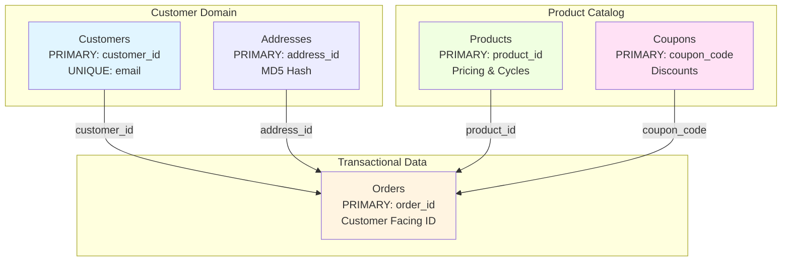

### Cardinality Notation

- **One-to-Many (1:N)**: `||--o{`
  - One customer can have many orders
  - One product can be in many orders

- **One-to-One Optional (1:0..1)**: `||--o|`
  - One order may have one cancellation record

- **Many-to-Many (N:M)**: `}o--o{`
  - Subscriptions logged in audit (via subscription_id, not FK)

---

## Order Management Flow

### Order Lifecycle Visualization

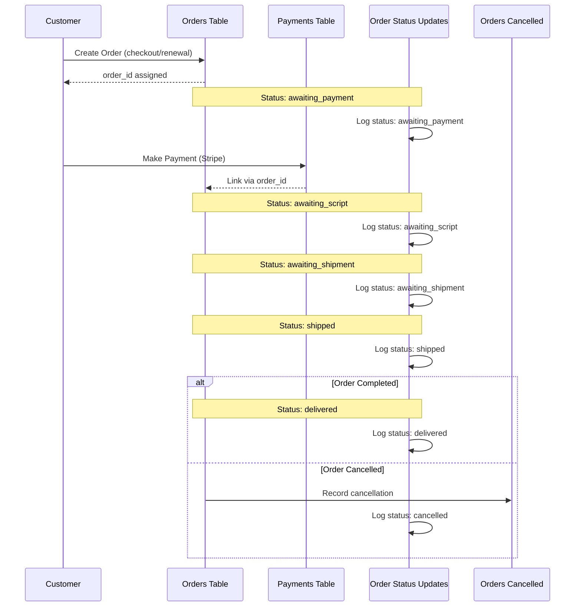

### Order Status Flow Chart

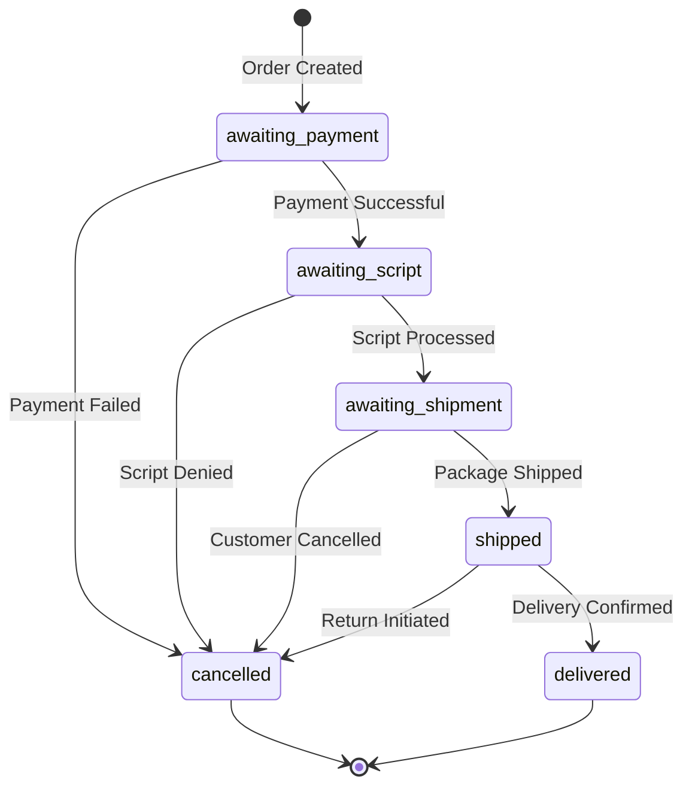

---

## Payment Processing Flow

### Payment and Refund Relationships

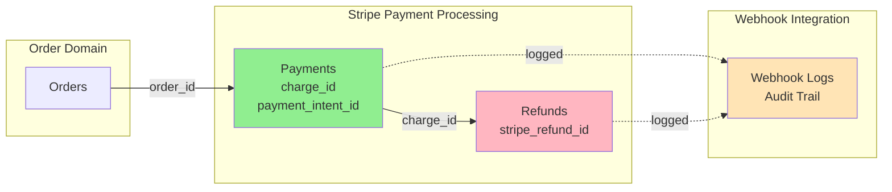

### Payment Processing Sequence

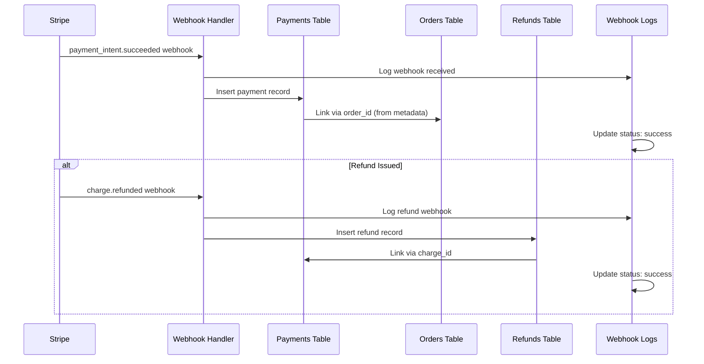

---

## Subscription Lifecycle

### Subscription State Management

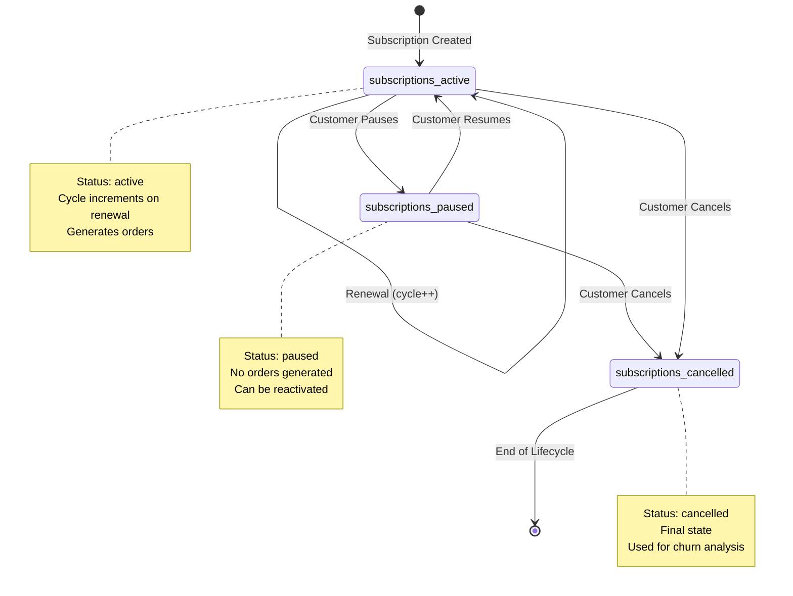

### Subscription Audit Trail

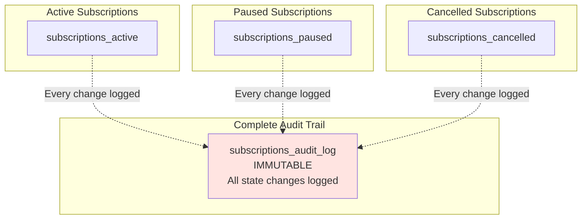

---

## Cardinality and Relationship Details

### Detailed Relationship Table

| Parent Table | Child Table | Relationship | Cardinality | FK Column | ON DELETE | ON UPDATE |
|--------------|-------------|--------------|-------------|-----------|-----------|-----------|
| customers | orders | One customer, many orders | 1:N | customer_id | RESTRICT | CASCADE |
| customers | subscriptions_active | One customer, many subscriptions | 1:N | customer_id | SET NULL | CASCADE |
| customers | subscriptions_paused | One customer, many subscriptions | 1:N | customer_id | SET NULL | CASCADE |
| customers | subscriptions_cancelled | One customer, many subscriptions | 1:N | customer_id | SET NULL | CASCADE |
| addresses | orders | One address, many orders | 1:N | shipping_address_id | SET NULL | CASCADE |
| products | orders | One product, many orders | 1:N | product_id | SET NULL | CASCADE |
| products | subscriptions_active | One product, many subscriptions | 1:N | product_id | SET NULL | CASCADE |
| products | subscriptions_paused | One product, many subscriptions | 1:N | product_id | SET NULL | CASCADE |
| products | subscriptions_cancelled | One product, many subscriptions | 1:N | product_id | SET NULL | CASCADE |
| coupons | orders | One coupon, many orders | 1:N | coupon_code | SET NULL | CASCADE |
| orders | payments | One order, many payments (rare) | 1:N | order_id | RESTRICT | CASCADE |
| orders | order_status_updates | One order, many status updates | 1:N | order_id | CASCADE | CASCADE |
| orders | orders_cancelled | One order, one cancellation | 1:0..1 | order_id | CASCADE | CASCADE |
| payments | refunds | One payment, many refunds | 1:N | charge_id | RESTRICT | CASCADE |

### Relationship Constraints Legend

**ON DELETE Actions:**
- **RESTRICT**: Prevents deletion if child records exist (protects data integrity)
- **CASCADE**: Automatically deletes child records when parent is deleted
- **SET NULL**: Sets foreign key to NULL when parent is deleted (allows orphans)

**ON UPDATE Actions:**
- **CASCADE**: Automatically updates foreign key when parent key changes

---

## Index Visualization

### Index Strategy by Table

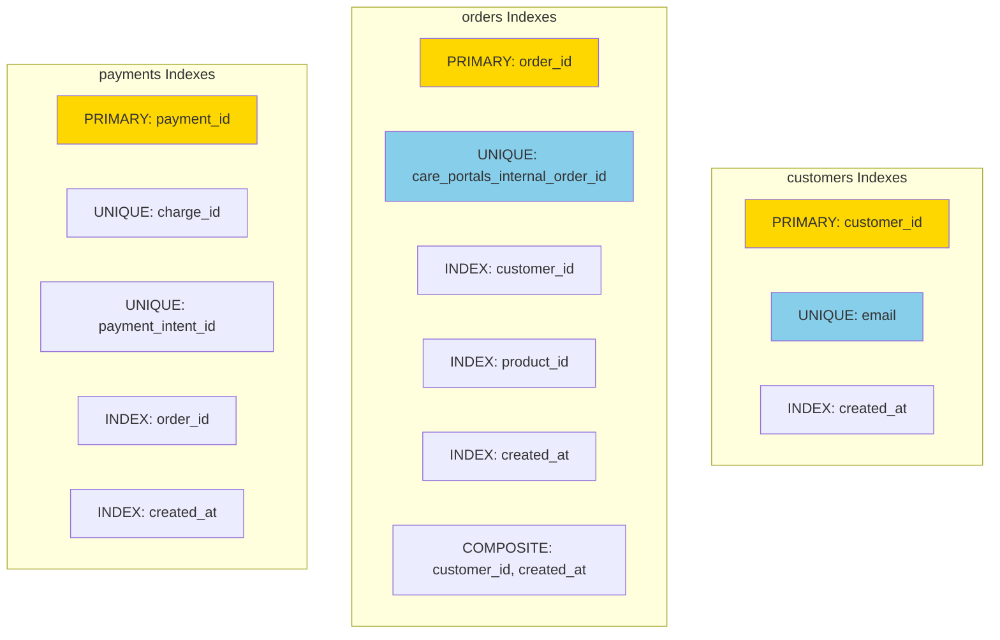

**Color Legend:**
- 🟡 Gold: Primary Key (Clustered Index)
- 🔵 Sky Blue: Unique Index
- ⚪ White: Regular Index

---

## Data Flow Diagrams

### Real-time Webhook Data Flow

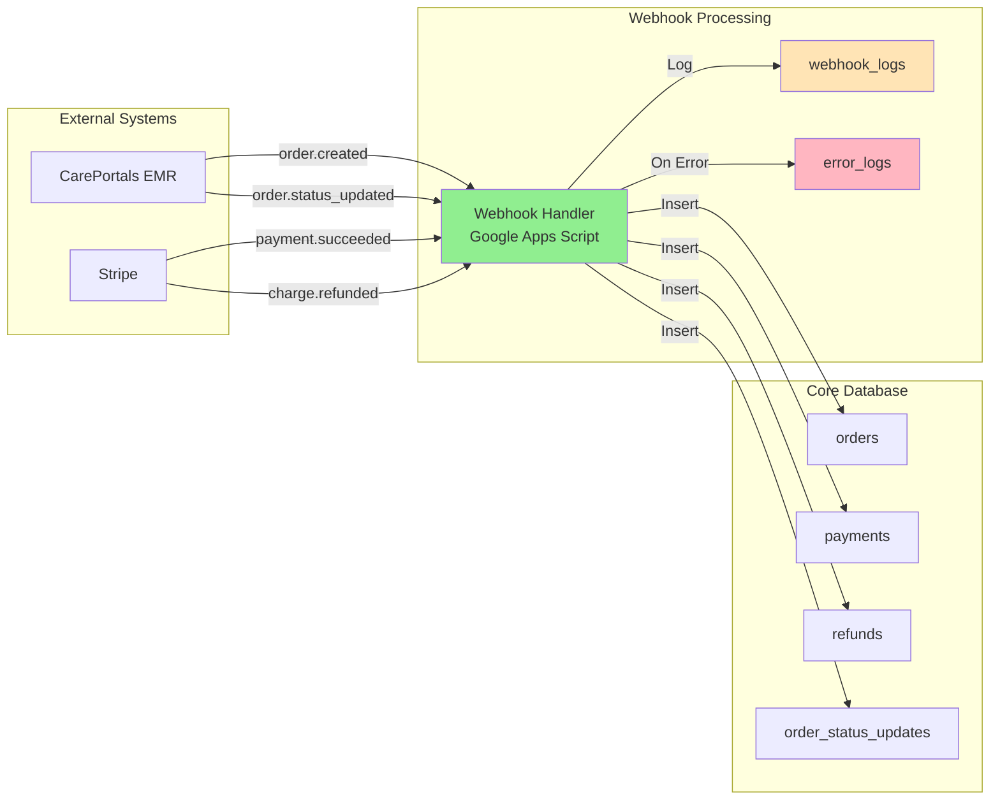

---

## Query Optimization Paths

### Common Query Patterns with Index Usage

#### Query 1: Customer Order History
```sql
-- Query
SELECT * FROM orders
WHERE customer_id = 'cust_123'
ORDER BY created_at DESC;

-- Index Used: idx_customer_created (customer_id, created_at)
```

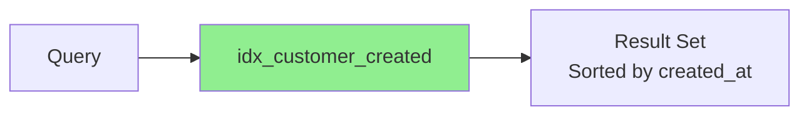

#### Query 2: Order Lifecycle Timeline
```sql
-- Query
SELECT * FROM order_status_updates
WHERE order_id = 1234
ORDER BY status_updated_at;

-- Index Used: idx_order_status_time (order_id, status_updated_at)
```

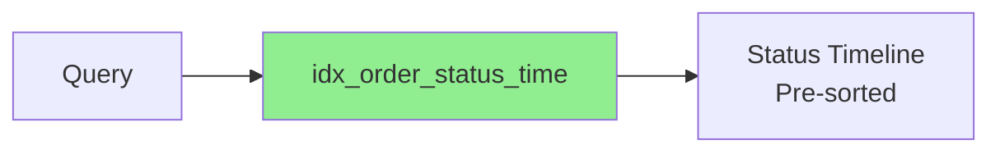

---

## Table Dependencies for Migration

### Migration Order (Respects Foreign Keys)

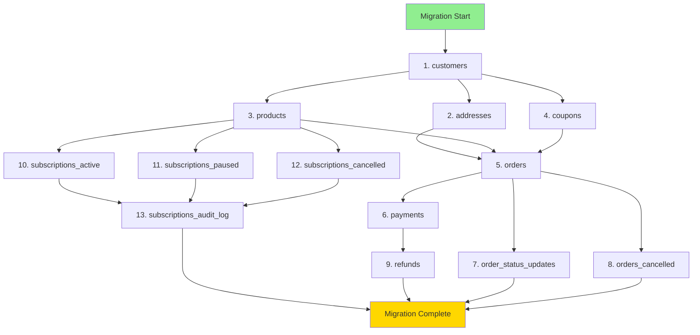

---

## Physical Storage Considerations

### Table Size Estimates (Based on Current Data)

| Table | Current Records | Growth Rate | Storage Estimate |
|-------|----------------|-------------|------------------|
| customers | 281 | ~50/month | Small (< 1 MB) |
| addresses | 248 | ~40/month | Small (< 1 MB) |
| products | 26 | ~5/year | Minimal (< 100 KB) |
| coupons | 4 | ~10/year | Minimal (< 100 KB) |
| **orders** | 476 | **~100/month** | **Medium (10-50 MB/year)** |
| **payments** | 438 | **~100/month** | **Medium (10-50 MB/year)** |
| refunds | 121 | ~25/month | Small (1-5 MB/year) |
| **order_status_updates** | **3,081** | **~600/month** | **Large (50-100 MB/year)** |
| orders_cancelled | 71 | ~15/month | Small (1 MB/year) |
| subscriptions_active | 206 | ~40/month | Small (5 MB/year) |
| subscriptions_paused | 15 | ~5/month | Minimal |
| subscriptions_cancelled | 53 | ~10/month | Small (1 MB/year) |
| **subscriptions_audit_log** | **202** | **~100/month** | **Medium (20-40 MB/year)** |
| questionnaire_responses | 145 | ~30/month | Small (5-10 MB/year) |
| **webhook_logs** | **N/A** | **~1000/month** | **Large (100+ MB/year)** |
| error_logs | N/A | ~50/month | Small (5 MB/year) |

**Key Observations:**
- order_status_updates will be largest table (high volume)
- webhook_logs requires archival strategy
- Consider partitioning for high-volume tables after 100K+ records

---

## Performance Optimization Strategy

### Index Coverage Analysis

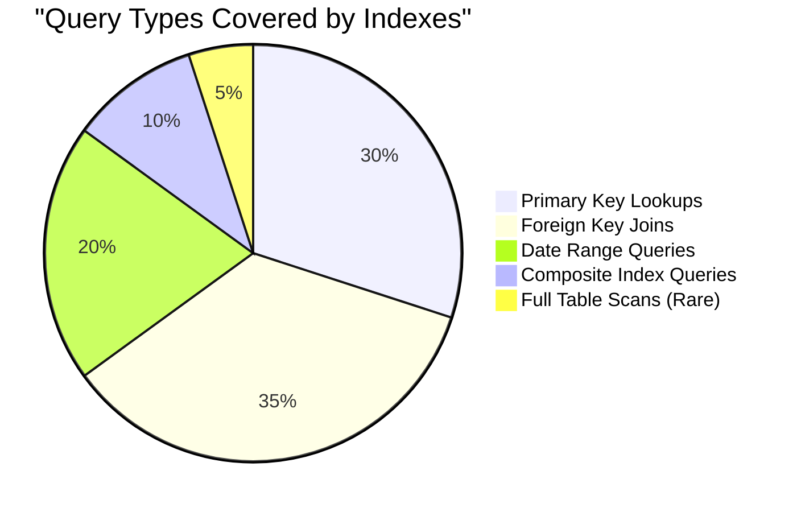

### Recommended Partitioning (Future)

```sql
-- Example: Partition orders by year for scalability
ALTER TABLE orders PARTITION BY RANGE (YEAR(created_at)) (
    PARTITION p2023 VALUES LESS THAN (2024),
    PARTITION p2024 VALUES LESS THAN (2025),
    PARTITION p2025 VALUES LESS THAN (2026),
    PARTITION p_future VALUES LESS THAN MAXVALUE
);
```

---

## Summary

### Database Design Highlights

✅ **16 Normalized Tables** following 3NF principles
✅ **40+ Indexes** optimized for common query patterns
✅ **18 Foreign Key Relationships** ensuring referential integrity
✅ **4 Views** simplifying complex queries
✅ **2 Stored Procedures** for common business logic
✅ **Audit Trails** for compliance (subscriptions, webhooks, errors)
✅ **Real-time Integration** ready (Stripe, CarePortals webhooks)

### Next Steps

1. ✅ Review ERD with stakeholders
2. ⏳ Execute DDL in test environment
3. ⏳ Migrate sample data
4. ⏳ Validate foreign key relationships
5. ⏳ Performance test with production load
6. ⏳ Plan production cutover

---

**Document Version:** 1.0
**Last Updated:** 2025-10-22
**Prepared By:** Claude Code

---

**End of ERD Documentation**
